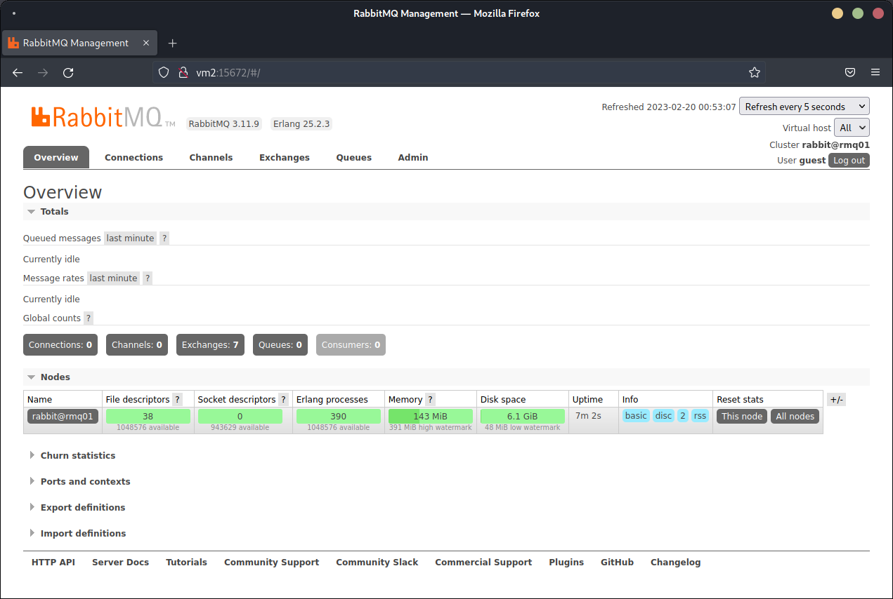
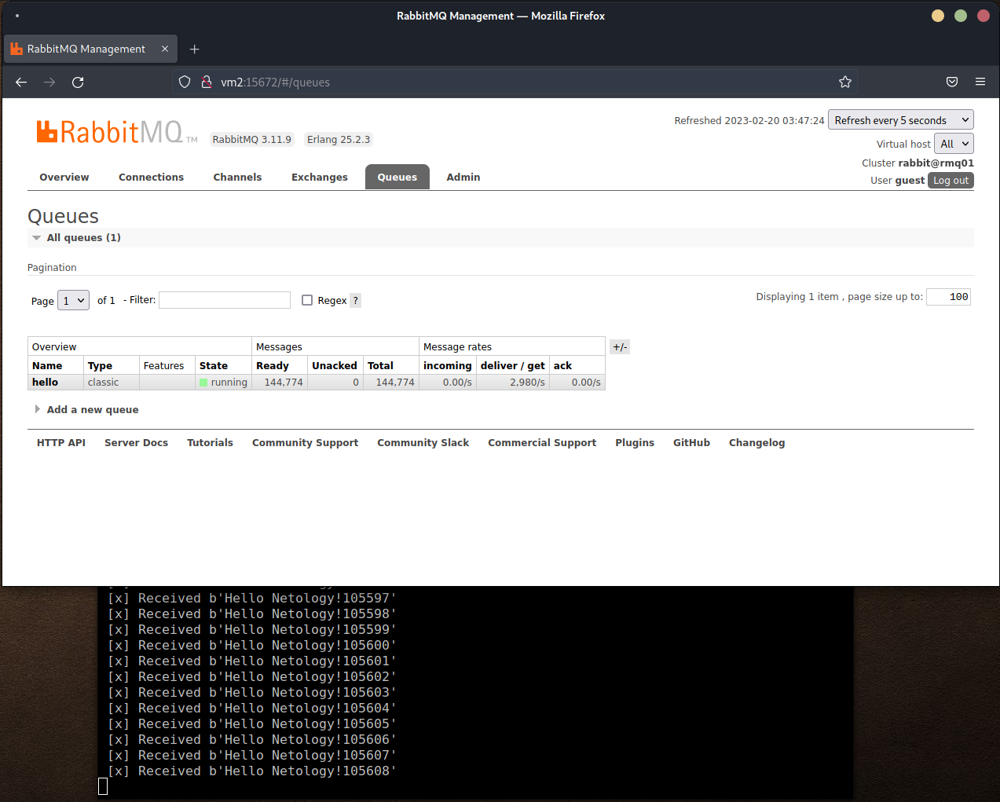

# Домашнее задание к занятию "`11.4. «Очереди RabbitMQ»`" - `Живарев Игорь`


### Задание 1





---

### Задание 2





---

### Задание 3


```
root@rmq01:/# rabbitmqctl cluster_status
RABBITMQ_ERLANG_COOKIE env variable support is deprecated and will be REMOVED in a future version. Use the $HOME/.erlang.cookie file or the --erlang-cookie switch instead.
Cluster status of node rabbit@rmq01 ...
Basics

Cluster name: rabbit@rmq01
Total CPU cores available cluster-wide: 2

Disk Nodes

rabbit@rmq01
rabbit@rmq02

Running Nodes

rabbit@rmq01
rabbit@rmq02

Versions

rabbit@rmq01: RabbitMQ 3.11.9 on Erlang 25.2.3
rabbit@rmq02: RabbitMQ 3.11.9 on Erlang 25.2.3

CPU Cores

Node: rabbit@rmq01, available CPU cores: 1
Node: rabbit@rmq02, available CPU cores: 1

Maintenance status

Node: rabbit@rmq01, status: not under maintenance
Node: rabbit@rmq02, status: not under maintenance

Alarms

(none)

Network Partitions

(none)

Listeners

Node: rabbit@rmq01, interface: [::], port: 15672, protocol: http, purpose: HTTP API
Node: rabbit@rmq01, interface: [::], port: 15692, protocol: http/prometheus, purpose: Prometheus exporter API over HTTP
Node: rabbit@rmq01, interface: [::], port: 25672, protocol: clustering, purpose: inter-node and CLI tool communication
Node: rabbit@rmq01, interface: [::], port: 5672, protocol: amqp, purpose: AMQP 0-9-1 and AMQP 1.0
Node: rabbit@rmq02, interface: [::], port: 15672, protocol: http, purpose: HTTP API
Node: rabbit@rmq02, interface: [::], port: 15692, protocol: http/prometheus, purpose: Prometheus exporter API over HTTP
Node: rabbit@rmq02, interface: [::], port: 25672, protocol: clustering, purpose: inter-node and CLI tool communication
Node: rabbit@rmq02, interface: [::], port: 5672, protocol: amqp, purpose: AMQP 0-9-1 and AMQP 1.0

Feature flags

Flag: classic_mirrored_queue_version, state: enabled
Flag: classic_queue_type_delivery_support, state: enabled
Flag: direct_exchange_routing_v2, state: enabled
Flag: drop_unroutable_metric, state: enabled
Flag: empty_basic_get_metric, state: enabled
Flag: feature_flags_v2, state: enabled
Flag: implicit_default_bindings, state: enabled
Flag: listener_records_in_ets, state: enabled
Flag: maintenance_mode_status, state: enabled
Flag: quorum_queue, state: enabled
Flag: stream_queue, state: enabled
Flag: stream_single_active_consumer, state: enabled
Flag: tracking_records_in_ets, state: enabled
Flag: user_limits, state: enabled
Flag: virtual_host_metadata, state: enabled

```
```
root@rmq02:/# rabbitmqctl cluster_status
RABBITMQ_ERLANG_COOKIE env variable support is deprecated and will be REMOVED in a future version. Use the $HOME/.erlang.cookie file or the --erlang-cookie switch instead.
Cluster status of node rabbit@rmq02 ...
Basics

Cluster name: rabbit@rmq02
Total CPU cores available cluster-wide: 2

Disk Nodes

rabbit@rmq01
rabbit@rmq02

Running Nodes

rabbit@rmq01
rabbit@rmq02

Versions

rabbit@rmq01: RabbitMQ 3.11.9 on Erlang 25.2.3
rabbit@rmq02: RabbitMQ 3.11.9 on Erlang 25.2.3

CPU Cores

Node: rabbit@rmq01, available CPU cores: 1
Node: rabbit@rmq02, available CPU cores: 1

Maintenance status

Node: rabbit@rmq01, status: not under maintenance
Node: rabbit@rmq02, status: not under maintenance

Alarms

(none)

Network Partitions

(none)

Listeners

Node: rabbit@rmq01, interface: [::], port: 15672, protocol: http, purpose: HTTP API
Node: rabbit@rmq01, interface: [::], port: 15692, protocol: http/prometheus, purpose: Prometheus exporter API over HTTP
Node: rabbit@rmq01, interface: [::], port: 25672, protocol: clustering, purpose: inter-node and CLI tool communication
Node: rabbit@rmq01, interface: [::], port: 5672, protocol: amqp, purpose: AMQP 0-9-1 and AMQP 1.0
Node: rabbit@rmq02, interface: [::], port: 15672, protocol: http, purpose: HTTP API
Node: rabbit@rmq02, interface: [::], port: 15692, protocol: http/prometheus, purpose: Prometheus exporter API over HTTP
Node: rabbit@rmq02, interface: [::], port: 25672, protocol: clustering, purpose: inter-node and CLI tool communication
Node: rabbit@rmq02, interface: [::], port: 5672, protocol: amqp, purpose: AMQP 0-9-1 and AMQP 1.0

Feature flags

Flag: classic_mirrored_queue_version, state: enabled
Flag: classic_queue_type_delivery_support, state: enabled
Flag: direct_exchange_routing_v2, state: enabled
Flag: drop_unroutable_metric, state: enabled
Flag: empty_basic_get_metric, state: enabled
Flag: feature_flags_v2, state: enabled
Flag: implicit_default_bindings, state: enabled
Flag: listener_records_in_ets, state: enabled
Flag: maintenance_mode_status, state: enabled
Flag: quorum_queue, state: enabled
Flag: stream_queue, state: enabled
Flag: stream_single_active_consumer, state: enabled
Flag: tracking_records_in_ets, state: enabled
Flag: user_limits, state: enabled
Flag: virtual_host_metadata, state: enabled

```


